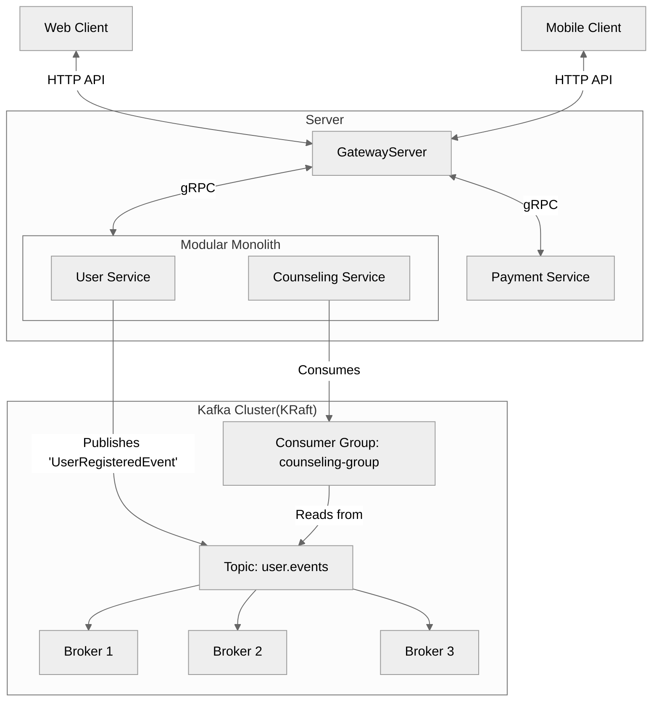
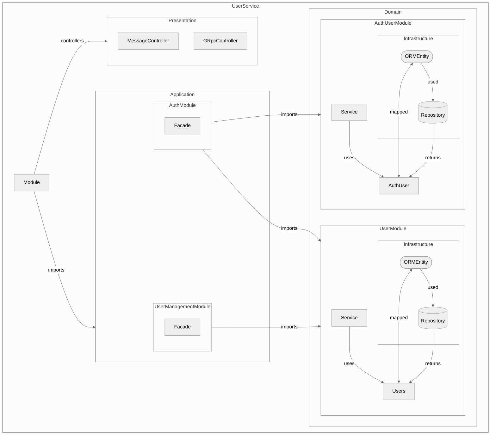

# hearlers-api

## 1. 서비스 개요

**event-driven-architecture**를 기반으로 하여 확장성 있는 애플리케이션을 추구합니다.
nest.js로 생성된 로직 공유를 위해, **modular-monolith** 아키텍처로 **유저 도메인**과 **상담 도메인**을 통합한 레포지토리 입니다. 환경변수 `SERVICE_TYPE` 설정을 통해서 모듈러 모놀리스 모드와 개별 마이크로 서비스 모드 중 선택해 부팅할 수 있습니다.

gRPC 호스트 서버로 gateway에게만 포트를 노출하며 다른 마이크로서비스와 연계가 필요한 경우 이벤트 기반으로 kafka를 통해 소통합니다.


| Category               | description                                                                                         |
| ---------------------- | --------------------------------------------------------------------------------------------------- |
| Concepts               | Domain Driven Design (Subdomains, Bounded Contexts, Ubiquitous Language, Aggregates, Value Objects) |
| Architecture style     | Event Driven Modular Monolith                                                                          |
| Architectural patterns | CQRS                                                                                                |
| Technology             | nest.js, Kafka, gRPC, PostgreSQL                                                                    |

## 1. 요구사항

- docker
- docker-compose

## 2. 실행 방법

### 2.1. RUN(LOCAL)

#### proto 파일 동기화 및 빌드

```bash
make build
```

#### 실행

```bash
yarn start
```

### 2.1. Deploying(DEV)


```bash
docker-compose up -d --build
```

## 3. 서비스 구조도

### 3.1 통신 구조



### 3.2 아키텍처




## 4. 서비스 설계

모든 서비스는 도메인 주도 설계의 원칙 아래, 바운디드 컨텍스트 단위로 설계한다. 초기 서비스는 팀의 규모 및 생산성을 고려해여 분리를 하며, 서비스 분리를 하는 우선순위는 다음과 같다.

1. **비즈니스 도메인별 독립성**
   비즈니스 상 독립적인 팀이 나눠 작업할 필요가 있는 지
2. **바운디드 컨텍스트의 크기**
   큰 도메인은 한 서비스로 유지하면 복잡성이 높아지고 관리가 어려워지므로 바운디드 컨텍스트를 기준으로 분리
3. **프레임워크 및 언어의 분리 필요성**
   기술적 요구사항이 분리된 경우 각 서비스가 적합한 언어와 프레임워크를 사용하여 최적화된 성능과 확장성을 제공
4. **서비스의 배포 및 확장 필요성**
   서비스의 변경 주기가 빠른 기능이 여러 팀에 영향을 미치지 않도록 독립된 서비스로 관리
5. **데이터 저장소 및 처리 방식의 차이**
   서로 다른 데이터 스토리지를 사용하는 경우. (분석 데이터와 비즈니스 데이터의 분리 등)
